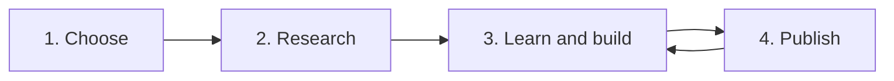

# Start Your Tech Career in 4 Steps

**For university students and recent graduates** who want a career in tech but don't know what to do yet, or know what they want but not how to start.

You don't need everything figured out. You need a starting point and a next step. This guide gives you both in about 10 minutes.

---

## Step 1: Choose a direction

Pick **one** entry-level role to aim for. Not forever, just for the next 3 months.

**Not sure which?** Start from what you enjoy:

| If you enjoy... | Look into... |
| --- | --- |
| Helping people, fixing problems | IT Support, Service Desk |
| Building and setting up systems | Cloud, Networking |
| Building systems *and* keeping them safe | Cloud Security |
| Investigating what went wrong | Cyber Security (SOC Analyst) |
| Writing code | Software Developer |
| Numbers and patterns | Data Analyst |
| Business and people | Business Analyst |

**Then check it's right for you:**

- Read a job profile for the role, for example on [Prospects](https://www.prospects.ac.uk/job-profiles): duties, entry routes and typical starting salaries.
- Watch a "day in the life of a [role]" video on YouTube.
- Find 2 people with that job title on LinkedIn and ask them one specific question.
- Try a free virtual work experience on [Forage](https://www.theforage.com/), made by real employers, or a free beginner course for a few hours.
- Book a free appointment with your university careers service. Graduates can usually still use it for a while after finishing.

**Stuck between two roles?** Pick the one you enjoyed more when you tried it. Still a tie? Pick the one with more entry-level ads near you.

**Changed your mind later?** That's fine. Most basics carry over to other tech roles.

---

## Step 2: Research the field

**Job ads tell you exactly what to learn.** Use them, not long online roadmaps.

1. Open **10 job ads** for your role on LinkedIn Jobs or Indeed (filtered to entry level), or graduate job sites in your country. In the UK, try [Gradcracker](https://www.gradcracker.com/), [Milkround](https://www.milkround.com/) and [Prospects](https://www.prospects.ac.uk/graduate-jobs).
2. Write down every skill and tool they mention.
3. Anything that shows up in **5 or more ads** is what you focus on.

**Ads asking for 1 to 2 years of experience?** Don't let that stop you. Job ads are wish lists, not hard rules. If you match about half the skills, apply anyway. Your projects count as experience.

**Know the timing.** Many graduate schemes and internships open months before they start, often a year ahead, and some close early once they are full. Check when your target employers open, and set job alerts.

**Set these up now:**

- A **LinkedIn** profile
- A **GitHub** account (where your projects will live)

---

## Step 3: Learn and build side by side

Don't wait until you "know enough". **Learn one topic, then build one small project with it.**

**How to learn without getting stuck in courses:** pick **one** free course or lab per skill. Start building when you are about halfway through, not at the end. You will find the gaps while building, and that is when you learn fastest.

### How to find the right projects for your field

This works for any specialisation, even one nobody around you knows well.

**1. Take the top 5 skills from your job ads (Step 2).** Each skill becomes one project.

**2. Turn each skill into a project using one of these four patterns:**

| Pattern | What you do |
| --- | --- |
| **Build it** | Set up the tool or system the ads mention and use it for a real task |
| **Break it, spot it, fix it** | Make a common mistake on purpose, find it, then fix it |
| **Automate it** | Take a task that is done by hand and do it with a script |
| **Explain it** | Investigate a real incident or problem and write up what happened and why |

**3. Find ideas when you're stuck:**

- **Job ad duties are project ideas.** "Monitor", "configure", "investigate", "report on": each one is a small version of the job you can do at home.
- **Search GitHub** for "[your role] project" or "[your role] home lab" to see what others build.
- **Free guided labs and job simulations** (such as Forage) are good first projects. Add something of your own.
- **Ask an AI tool:** "Give me 5 beginner projects for a junior [role] using only free tools, each one proving [skill]." Then check every idea against your job ads.

**4. Keep a project only if it passes all four checks:**

- [ ] It proves a skill that appears in 5+ of your job ads
- [ ] You can do it with free tools
- [ ] You can finish it in 1 to 2 weeks
- [ ] You can show the result in a screenshot

**5. Put them in order.** Start with the most basic skill, then let each project build on the last.

### Three rules

1. **Small and finished** beats big and half-done.
2. **Change one thing** in any tutorial so it becomes your own.
3. **Note every problem you hit** and how you fixed it. These become your best interview answers.

---

## Step 4: Publish every project

A project nobody sees doesn't help you. Every time you finish one:

1. **Upload it to GitHub** (public), with a short README: what it is, the tools you used, screenshots, the problems you fixed, and what you learned.
2. **Post it on LinkedIn** with the GitHub link. Share what you learned, not just "I finished a project".
3. **Once you have 3+ projects**, make a simple portfolio website. [GitHub Pages](https://pages.github.com/) is free.

### Never used GitHub? Do this (no coding needed)

1. Sign in to [GitHub](https://github.com/), click **+** (top right), then **New repository**.
2. Give it a clear name that says what the project is, set it to **Public**, tick **Add a README file**, then click **Create repository**.
3. Click **Add file → Upload files**, drag in your files and screenshots, then click **Commit changes**.
4. Open **README.md**, click the pencil icon, and write: what the project is, the tools used, the steps with screenshots, the problems you fixed, what you learned. To show a screenshot you uploaded, write ``.
5. Copy the repository link and add it to your LinkedIn post.

You can learn the command-line way (git) later. Uploading through the website is enough to start.

### Then use your projects

- **On your CV:** add a Projects section with each project's GitHub link.
- **In applications and interviews:** use your "problems I hit" notes as your examples.
- **When you apply:** add your GitHub link to every application.

---

## Quick answers

**I don't have a tech degree. Can I still do this?** Yes. Many graduate tech schemes accept any degree, and at entry level what you can show matters most.

**I'm in first or second year. Is it too early?** No. Starting early is the biggest advantage you can give yourself. One project a month adds up to a strong portfolio by final year.

**How many projects do I need?** Start with one. Three to five finished projects that match your role is a strong portfolio.

**Do I need to pay for courses?** No. Start free. Only pay for a certificate if it keeps appearing in your job ads.

**What if I pick the wrong direction?** You review after 3 months and switch if needed. Nothing you learned is wasted.

---

## Your first move today

1. Pick one role from the table in Step 1.
2. Open 10 job ads for it.
3. Create your GitHub account.

That's it. Start there.

---

*Written by Hajra Ramzan. Links last checked October 2026.*
